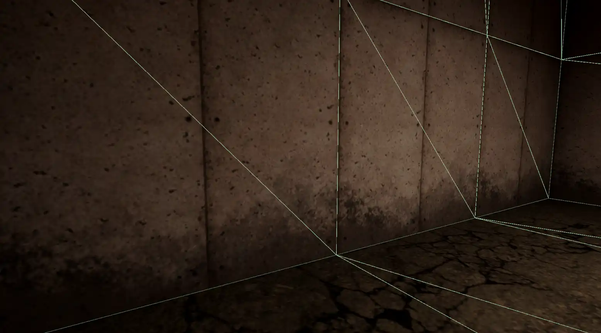

# What is this?
Unity has an issue. Box cast returns incorrect normal vectors against some mesh colliders, seeming most prominent with Probuilder meshes. This repository contains a script that fixes this behaviour for good with its own box cast replacement function that calculates its own normal vector.

**Before**

 

**After**

 

# How do I use this?
The MoveSimple script is a very simple boxcast-based player controller. The fix for bad normals is inside the CastPlayer function. Use that function instead of BoxCast, and it should work. The function is a proof of concept, and will likely need to be adapted a little for your project. Specifically, it doesn't support rotation.
